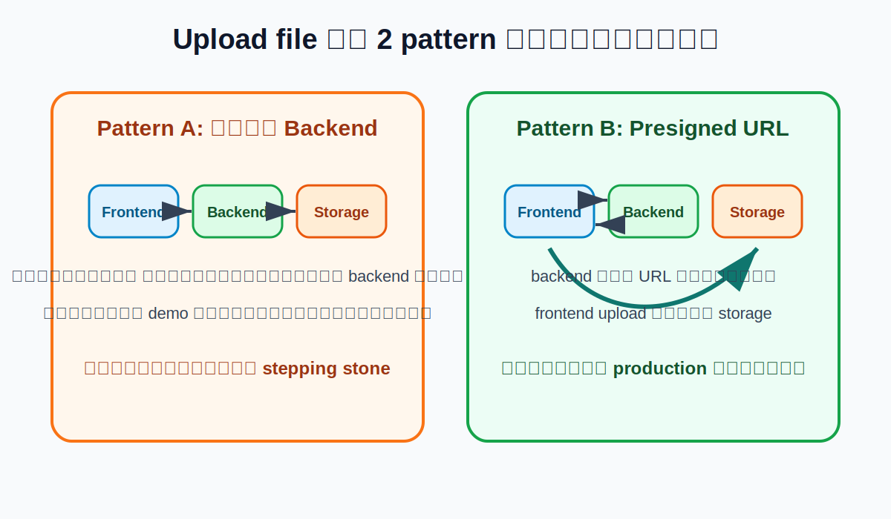

<style>
html, body, #app, .slidev-page, .slidev-layout {
  background: #f8fafc !important;
  color: #0f172a !important;
  color-scheme: light !important;
}
html.dark, html.dark body, html.dark #app, html.dark .slidev-page, html.dark .slidev-layout, .dark .slidev-layout {
  background: #f8fafc !important;
  color: #0f172a !important;
}
.slidev-layout h1, .slidev-layout h2, .slidev-layout h3,
.slidev-layout p, .slidev-layout li, .slidev-layout table,
.slidev-layout td, .slidev-layout th {
  color: #0f172a !important;
}
.slidev-layout a { color: #0369a1 !important; }
.slidev-code {
  font-size: 0.74rem !important;
  line-height: 1.25 !important;
  max-height: 430px;
  overflow: auto !important;
}
pre { max-height: 430px; overflow: auto !important; }
table { font-size: 0.92rem; }
.bg-slate-900, .bg-slate-900 * { color: #f8fafc !important; }
.bg-white *, .bg-sky-50 *, .bg-emerald-50 *, .bg-orange-50 *,
.bg-red-50 *, .bg-violet-50 *, .bg-slate-100 * { color: #0f172a; }
</style>

# Storage Module

S3-Compatible Object Storage สำหรับเว็บที่มีการ upload ไฟล์

<div class="mt-10 text-xl text-slate-600">
ส่วนนี้เชื่อม frontend + backend เข้ากับที่เก็บไฟล์จริง
</div>

---

# ภาพรวมคาบนี้

<div class="mt-5 text-xl text-slate-600">
สำหรับช่วง storage ประมาณ 75 นาที ปรับได้ 60-90 นาที
</div>

<div class="grid grid-cols-3 gap-5 mt-8">
  <div class="rounded-lg bg-white p-6 shadow border border-slate-200">
    <div class="text-sm text-sky-700 font-bold">0:00 - 0:25</div>
    <div class="text-2xl font-bold mt-2">Concept</div>
    <div class="mt-3 text-slate-600">ไฟล์ควรอยู่ที่ไหน, S3 คืออะไร</div>
  </div>
  <div class="rounded-lg bg-white p-6 shadow border border-slate-200">
    <div class="text-sm text-emerald-700 font-bold">0:25 - 1:05</div>
    <div class="text-2xl font-bold mt-2">Hands-on</div>
    <div class="mt-3 text-slate-600">bucket, backend ออก URL, frontend upload</div>
  </div>
  <div class="rounded-lg bg-white p-6 shadow border border-slate-200">
    <div class="text-sm text-orange-700 font-bold">1:05 - 1:15</div>
    <div class="text-2xl font-bold mt-2">Wrap-up</div>
    <div class="mt-3 text-slate-600">security, common bugs, recap</div>
  </div>
</div>

<div class="mt-8 rounded-lg bg-slate-100 p-4 text-lg text-slate-700">
ถ้าเวลาน้อย: ให้ demo backend/frontend upload แล้วให้น้องทำต่อจาก repo หลังคลาส
</div>

---

# Story เดียวของวันนี้

<div class="text-3xl font-bold mt-10">
เว็บชมรมมีหน้า Profile
</div>

<div class="grid grid-cols-3 gap-5 mt-8">
  <div class="rounded-lg bg-white p-6 shadow border border-slate-200">
    <div class="text-2xl font-bold">1. User เลือกรูป</div>
    <div class="mt-3 text-slate-600">frontend ได้ `File` จาก input</div>
  </div>
  <div class="rounded-lg bg-white p-6 shadow border border-slate-200">
    <div class="text-2xl font-bold">2. Backend คุมสิทธิ์</div>
    <div class="mt-3 text-slate-600">เช็ค login, type, size</div>
  </div>
  <div class="rounded-lg bg-white p-6 shadow border border-slate-200">
    <div class="text-2xl font-bold">3. Storage เก็บไฟล์</div>
    <div class="mt-3 text-slate-600">เก็บรูปจริงใน bucket</div>
  </div>
</div>

<div class="mt-10 text-2xl text-slate-700">
คำถามแรก: ไฟล์รูปควรเก็บไว้ที่ไหน?
</div>

---

# วิธีแรกที่หลายคนคิดถึง

<div class="grid grid-cols-2 gap-8 mt-8 items-center">

<div>

```txt
project/
  src/
  uploads/
    avatar-01.jpg
    proof-payment.pdf
```

<div class="mt-6 text-xl text-slate-600">
Backend รับไฟล์แล้วเขียนลง folder `uploads/`
</div>

</div>

<div class="rounded-lg bg-orange-50 border-l-8 border-orange-500 p-6 text-xl">
ใช้ได้สำหรับ demo เล็กมาก แต่ไม่เหมาะกับระบบที่ deploy, scale หรือดูแลระยะยาว
</div>

</div>

---
layout: image-right
image: ./assets/local-upload-problem.svg
backgroundSize: contain
---

# ทำไม local uploads ถึงเริ่มมีปัญหา

<div class="text-xl mt-8 space-y-4">

- deploy ใหม่แล้วไฟล์อาจหาย
- scale หลาย backend แล้วไฟล์อยู่คนละเครื่อง
- backup ยาก
- disk เต็มแล้ว backend ล่ม
- ไฟล์ใหญ่ทำให้ backend หนัก

</div>

<div class="mt-8 rounded-lg bg-sky-50 border-l-8 border-sky-500 p-5 text-xl">
สรุป: backend ไม่ควรเป็นที่เก็บไฟล์หลัก
</div>

---

# ทางออก: แยกหน้าที่

<div class="grid grid-cols-4 gap-4 mt-10">
  <div class="rounded-lg bg-white border border-slate-200 p-5 shadow">
    <div class="font-bold text-xl text-sky-800">Frontend</div>
    <div class="mt-3 text-slate-600">เลือกไฟล์ แสดง preview</div>
  </div>
  <div class="rounded-lg bg-white border border-slate-200 p-5 shadow">
    <div class="font-bold text-xl text-emerald-800">Backend</div>
    <div class="mt-3 text-slate-600">auth, validate, ออกสิทธิ์</div>
  </div>
  <div class="rounded-lg bg-white border border-slate-200 p-5 shadow">
    <div class="font-bold text-xl text-violet-800">Database</div>
    <div class="mt-3 text-slate-600">เก็บ metadata</div>
  </div>
  <div class="rounded-lg bg-white border border-slate-200 p-5 shadow">
    <div class="font-bold text-xl text-orange-800">Object Storage</div>
    <div class="mt-3 text-slate-600">เก็บไฟล์จริง</div>
  </div>
</div>

<div class="mt-10 text-2xl font-bold text-center text-slate-700">
ไฟล์อยู่ใน storage, ข้อมูลอ้างอิงอยู่ใน database
</div>

---
layout: image
image: ./assets/storage-types.svg
backgroundSize: contain
---

---

# วันนี้เราใช้ Object Storage

<div class="grid grid-cols-3 gap-6 mt-8">
  <div class="rounded-lg bg-blue-50 p-6 border border-blue-200">
    <div class="text-2xl font-bold text-blue-900">Block</div>
    <div class="mt-4 text-lg">เหมือน disk</div>
    <div class="mt-4 text-slate-600">เหมาะกับ DB/VM</div>
  </div>
  <div class="rounded-lg bg-green-50 p-6 border border-green-200">
    <div class="text-2xl font-bold text-green-900">File</div>
    <div class="mt-4 text-lg">เหมือน shared folder</div>
    <div class="mt-4 text-slate-600">เหมาะกับ NFS/path workload</div>
  </div>
  <div class="rounded-lg bg-orange-50 p-6 border border-orange-200">
    <div class="text-2xl font-bold text-orange-900">Object</div>
    <div class="mt-4 text-lg">เหมือนกล่องผ่าน API</div>
    <div class="mt-4 text-slate-600">เหมาะกับรูป PDF video backup</div>
  </div>
</div>

---
layout: image-right
image: ./assets/bucket-object.svg
backgroundSize: contain
---

# Object Storage มีอะไรบ้าง

<div class="text-xl mt-8 space-y-4">

- **Bucket** = กล่องใหญ่ เช่น `club-assets`
- **Object** = ไฟล์หนึ่งชิ้น
- **Key** = ชื่อ object เช่น `profiles/u1/avatar.png`
- **Metadata** = ข้อมูลประกอบ เช่น content type, size
- **Endpoint** = URL ของ storage เช่น `http://localhost:9000`

</div>

---

# S3 คืออะไร

<div class="grid grid-cols-3 gap-5 mt-10 text-center">
  <div class="rounded-lg bg-white p-7 shadow border border-slate-200">
    <div class="text-5xl font-bold text-sky-700">S</div>
    <div class="mt-4 text-2xl font-bold">Simple</div>
    <div class="mt-3 text-slate-600">API ใช้งานง่าย</div>
  </div>
  <div class="rounded-lg bg-white p-7 shadow border border-slate-200">
    <div class="text-5xl font-bold text-emerald-700">S</div>
    <div class="mt-4 text-2xl font-bold">Storage</div>
    <div class="mt-3 text-slate-600">บริการเก็บข้อมูล</div>
  </div>
  <div class="rounded-lg bg-white p-7 shadow border border-slate-200">
    <div class="text-5xl font-bold text-orange-700">S</div>
    <div class="mt-4 text-2xl font-bold">Service</div>
    <div class="mt-3 text-slate-600">ใช้งานผ่าน network/API</div>
  </div>
</div>

<div class="mt-10 text-2xl text-center text-slate-700">
S3 = <b>Simple Storage Service</b>
</div>

---

# S3-Compatible คืออะไร

<div class="grid grid-cols-2 gap-8 mt-10 items-center">
  <div class="text-2xl leading-relaxed">
    เดิม S3 คือบริการของ AWS แต่ API ของ S3 กลายเป็นมาตรฐานที่หลาย provider รองรับ
  </div>
  <div class="rounded-xl bg-slate-900 text-white p-8 shadow-xl">
    <div class="text-sm text-slate-300">จำง่ายๆ</div>
    <div class="text-4xl font-bold mt-3">S3-compatible</div>
    <div class="mt-5 text-xl text-slate-200">
      storage เจ้าอื่นที่คุยด้วย S3 API ได้
    </div>
  </div>
</div>

---

# Provider ที่เจอบ่อย

<div class="grid grid-cols-3 gap-5 mt-8 text-center text-xl">
  <div class="rounded-lg bg-white p-6 shadow border">AWS S3</div>
  <div class="rounded-lg bg-white p-6 shadow border">MinIO / AIStor</div>
  <div class="rounded-lg bg-white p-6 shadow border">Cloudflare R2</div>
  <div class="rounded-lg bg-white p-6 shadow border">Wasabi</div>
  <div class="rounded-lg bg-white p-6 shadow border">Backblaze B2</div>
  <div class="rounded-lg bg-white p-6 shadow border">Ceph</div>
</div>

<div class="mt-10 text-2xl text-center text-slate-700">
วันนี้ local ใช้ MinIO-style endpoint เพื่อเข้าใจ concept เดียวกับ AIStor/S3-compatible
</div>

---

# ก่อนลงมือ: Architecture วันนี้

<div class="grid grid-cols-4 gap-4 mt-10 text-center">
  <div class="rounded-lg bg-white p-5 shadow border">
    <div class="font-bold text-xl">1. Frontend</div>
    <div class="mt-3 text-slate-600">เลือกไฟล์</div>
  </div>
  <div class="rounded-lg bg-white p-5 shadow border">
    <div class="font-bold text-xl">2. Backend</div>
    <div class="mt-3 text-slate-600">ตรวจสิทธิ์และออก URL</div>
  </div>
  <div class="rounded-lg bg-white p-5 shadow border">
    <div class="font-bold text-xl">3. Storage</div>
    <div class="mt-3 text-slate-600">รับไฟล์เข้า bucket</div>
  </div>
  <div class="rounded-lg bg-white p-5 shadow border">
    <div class="font-bold text-xl">4. Database</div>
    <div class="mt-3 text-slate-600">เก็บ key/metadata</div>
  </div>
</div>

<div class="mt-10 rounded-lg bg-sky-50 border-l-8 border-sky-500 p-5 text-xl">
เราจะค่อยๆ สร้างจาก storage ก่อน แล้วค่อยต่อ backend และ frontend
</div>

---
layout: center
class: text-center text-slate-800 bg-slate-50
---

# Lab 1

เปิด storage console → สร้าง bucket → upload file ด้วยมือ

---
layout: image
image: ./assets/minio-console-steps.svg
backgroundSize: contain
---

---

# Lab 1: เปิด Console

```bash
docker compose up -d
```

<div class="grid grid-cols-2 gap-6 mt-8">
  <div class="rounded-lg bg-white p-6 shadow border">
    <div class="text-sm text-slate-500">Storage API endpoint</div>
    <div class="text-2xl font-bold mt-2">http://localhost:9000</div>
  </div>
  <div class="rounded-lg bg-white p-6 shadow border">
    <div class="text-sm text-slate-500">Console UI</div>
    <div class="text-2xl font-bold mt-2">http://localhost:9001</div>
  </div>
</div>

<div class="mt-8 text-xl">
Login: `minioadmin` / `minioadmin`
</div>

---

# Lab 1: สร้าง Bucket และ Upload

<div class="grid grid-cols-2 gap-8 mt-8">
  <div class="rounded-lg bg-white p-6 shadow border">
    <div class="text-2xl font-bold">สร้าง bucket</div>
    <ol class="mt-5 text-lg space-y-2">
      <li>เปิด `http://localhost:9001`</li>
      <li>เข้าเมนู Buckets</li>
      <li>กด Create Bucket</li>
      <li>ตั้งชื่อ `club-assets`</li>
    </ol>
  </div>
  <div class="rounded-lg bg-white p-6 shadow border">
    <div class="text-2xl font-bold">ลอง upload ด้วยมือ</div>
    <ol class="mt-5 text-lg space-y-2">
      <li>เข้า Object Browser</li>
      <li>เลือก bucket `club-assets`</li>
      <li>กด Upload</li>
      <li>เลือกไฟล์รูป 1 ไฟล์</li>
      <li>ดูชื่อ object key ที่เกิดขึ้น</li>
    </ol>
  </div>
</div>

---

# Checkpoint 1

<div class="rounded-xl bg-sky-50 border-l-8 border-sky-500 p-8 mt-8 text-xl">

ให้น้องทำให้เสร็จใน 8-10 นาที

1. เข้า console ได้
2. สร้าง bucket `club-assets`
3. upload รูป 1 ไฟล์ผ่าน console
4. ชี้ให้ได้ว่า bucket อยู่ตรงไหน และ object key อยู่ตรงไหน

</div>

---

# ต่อไปต้องเชื่อม Backend

ตอนนี้เรา upload ผ่าน console ได้แล้ว

<div class="mt-8 text-2xl">
แต่เว็บจริง user ไม่ควรต้องเข้า console
</div>

<div class="grid grid-cols-2 gap-8 mt-8">
  <div class="rounded-lg bg-white p-6 shadow border">
    <div class="text-xl font-bold">สิ่งที่ user ทำ</div>
    <div class="mt-3 text-slate-600">เลือกไฟล์จากหน้าเว็บ</div>
  </div>
  <div class="rounded-lg bg-white p-6 shadow border">
    <div class="text-xl font-bold">สิ่งที่ backend ทำ</div>
    <div class="mt-3 text-slate-600">คุมสิทธิ์ และบอกว่าจะเก็บไฟล์ไว้ key ไหน</div>
  </div>
</div>

---

# Upload ผ่านเว็บมี 2 แบบ

<div class="mt-5 text-xl text-slate-600">
หน้านี้คือสะพานไปหา presigned URL
</div>



---

# ทำไมเลือก Presigned URL

<div class="grid grid-cols-2 gap-8 mt-8">
  <div class="rounded-lg bg-red-50 p-6 border border-red-200">
    <div class="text-2xl font-bold text-red-900">ห้ามทำ</div>
    <div class="mt-4 text-lg">เอา access key / secret key ไปใส่ frontend</div>
    <div class="mt-4 text-red-800 font-bold">ถ้าหลุด คนอื่นอาจอ่าน/เขียนไฟล์ใน bucket ได้</div>
  </div>
  <div class="rounded-lg bg-emerald-50 p-6 border border-emerald-200">
    <div class="text-2xl font-bold text-emerald-900">ควรทำ</div>
    <div class="mt-4 text-lg">backend ถือ secret แล้วออก URL ชั่วคราวให้ frontend</div>
    <div class="mt-4 text-emerald-800 font-bold">frontend upload ได้โดยไม่รู้ secret</div>
  </div>
</div>

---
layout: image-right
image: ./assets/presigned-url.svg
backgroundSize: contain
---

# Presigned URL คืออะไร

<div class="text-xl mt-8 space-y-4">

- URL ชั่วคราวที่ backend สร้างให้
- ใช้ upload ไป object key ที่กำหนด
- มีวันหมดอายุ เช่น 5 นาที
- frontend ใช้ URL นี้ได้ แต่ไม่เห็น secret key

</div>

<div class="mt-8 rounded-lg bg-sky-50 border-l-8 border-sky-500 p-5 text-xl">
คิดเหมือนบัตรผ่านชั่วคราวสำหรับ upload ไฟล์หนึ่งครั้ง
</div>

---
layout: center
class: text-center text-slate-800 bg-slate-50
---

# Lab 2

Backend สร้าง Presigned Upload URL

---

# Lab 2: ตั้งค่า Backend

```properties
S3_ENDPOINT=http://localhost:9000
S3_REGION=us-east-1
S3_BUCKET=club-assets
S3_ACCESS_KEY=minioadmin
S3_SECRET_KEY=minioadmin
S3_FORCE_PATH_STYLE=true
```

<div class="mt-8 rounded-lg bg-orange-50 border-l-8 border-orange-500 p-5 text-xl">
local S3-compatible storage มักต้องใช้ `forcePathStyle: true`
</div>

---

# API ที่ Backend ต้องมี

<div class="grid grid-cols-2 gap-8 mt-8">

<div>

```http
POST /uploads/presign
Content-Type: application/json

{
  "filename": "avatar.png",
  "contentType": "image/png"
}
```

</div>

<div>

```json
{
  "key": "profiles/u1/uuid.png",
  "uploadUrl": "http://localhost:9000/...",
  "expiresIn": 300
}
```

</div>

</div>

---

# Backend ต้องทำ 4 เรื่อง

<div class="grid grid-cols-2 gap-5 mt-8 text-xl">
  <div class="rounded-lg bg-white p-5 shadow border">
    <div class="font-bold">1. Validate</div>
    <div class="mt-2 text-slate-600">รับเฉพาะ file type/size ที่อนุญาต</div>
  </div>
  <div class="rounded-lg bg-white p-5 shadow border">
    <div class="font-bold">2. Generate key</div>
    <div class="mt-2 text-slate-600">สร้างชื่อ object เอง ไม่ใช้ filename ตรงๆ</div>
  </div>
  <div class="rounded-lg bg-white p-5 shadow border">
    <div class="font-bold">3. Sign URL</div>
    <div class="mt-2 text-slate-600">สร้าง URL ชั่วคราวจาก S3 SDK</div>
  </div>
  <div class="rounded-lg bg-white p-5 shadow border">
    <div class="font-bold">4. Save metadata</div>
    <div class="mt-2 text-slate-600">บันทึก bucket/key/owner ลง database</div>
  </div>
</div>

---

# ตัวอย่าง Service แบบย่อ

```ts {all|1-8|10-18}
const s3 = new S3Client({
  endpoint: process.env.S3_ENDPOINT,
  region: process.env.S3_REGION,
  credentials: {
    accessKeyId: process.env.S3_ACCESS_KEY!,
    secretAccessKey: process.env.S3_SECRET_KEY!,
  },
  forcePathStyle: true,
})

async function createUploadUrl(filename: string, contentType: string) {
  const ext = filename.split('.').pop() || 'bin'
  const key = `profiles/${randomUUID()}.${ext}`
  const command = new PutObjectCommand({
    Bucket: process.env.S3_BUCKET,
    Key: key,
    ContentType: contentType,
  })
  const uploadUrl = await getSignedUrl(s3, command, { expiresIn: 300 })
  return { key, uploadUrl, expiresIn: 300 }
}
```

---

# Checkpoint 2

<div class="rounded-xl bg-emerald-50 border-l-8 border-emerald-500 p-8 mt-8 text-xl">

ให้น้องทำให้เสร็จใน 12-15 นาที

1. backend start ได้
2. เรียก `POST /uploads/presign`
3. response มี `key`, `uploadUrl`, `expiresIn`
4. อธิบายได้ว่า URL นี้ใช้ทำอะไร

</div>

---

# Test Backend

```bash
curl -X POST http://localhost:3000/uploads/presign \
  -H 'Content-Type: application/json' \
  -d '{"filename":"avatar.png","contentType":"image/png"}'
```

<div class="mt-8 text-xl">
ถ้าได้ `uploadUrl` แปลว่า backend ต่อ storage ได้แล้ว
</div>

---
layout: center
class: text-center text-slate-800 bg-slate-50
---

# Lab 3

Frontend ใช้ upload URL เพื่อส่งไฟล์เข้า storage

---

# Frontend Flow

<div class="grid grid-cols-5 gap-3 mt-10 text-center">
  <div class="rounded-lg bg-white p-5 shadow border">เลือกไฟล์</div>
  <div class="rounded-lg bg-white p-5 shadow border">ขอ URL</div>
  <div class="rounded-lg bg-white p-5 shadow border">ได้ key + URL</div>
  <div class="rounded-lg bg-white p-5 shadow border">PUT file</div>
  <div class="rounded-lg bg-white p-5 shadow border">save key</div>
</div>

<div class="mt-10 text-2xl text-center text-slate-700">
Frontend ไม่ถือ secret แต่ upload ได้ด้วย URL ชั่วคราว
</div>

---

# Frontend Upload Code

```ts {all|2-10|12-16|18}
async function uploadAvatar(file: File) {
  const presignRes = await fetch('http://localhost:3000/uploads/presign', {
    method: 'POST',
    headers: { 'Content-Type': 'application/json' },
    body: JSON.stringify({
      filename: file.name,
      contentType: file.type,
    }),
  })

  const { key, uploadUrl } = await presignRes.json()

  const uploadRes = await fetch(uploadUrl, {
    method: 'PUT',
    headers: { 'Content-Type': file.type },
    body: file,
  })

  if (!uploadRes.ok) throw new Error('Upload failed')
  return { key }
}
```

---

# Checkpoint 3

<div class="rounded-xl bg-violet-50 border-l-8 border-violet-500 p-8 mt-8 text-xl">

ให้น้องทำให้เสร็จใน 10-15 นาที

1. เลือกไฟล์จากหน้าเว็บ
2. frontend ขอ presigned URL จาก backend
3. frontend upload file ไป storage
4. กลับไปดูใน console แล้วเห็น object ใหม่ใน bucket

</div>

---

# CORS ถ้าเจอไม่ต้องตกใจ

<div class="grid grid-cols-2 gap-8 mt-8">
  <div class="rounded-lg bg-white p-6 shadow border">
    <div class="text-xl font-bold">Frontend</div>
    <div class="mt-3 text-lg text-slate-600">http://localhost:5173</div>
  </div>
  <div class="rounded-lg bg-white p-6 shadow border">
    <div class="text-xl font-bold">Storage</div>
    <div class="mt-3 text-lg text-slate-600">http://localhost:9000</div>
  </div>
</div>

<div class="mt-8 rounded-lg bg-orange-50 border-l-8 border-orange-500 p-5 text-xl">
คนละ origin จึงต้องตั้ง CORS ให้ storage อนุญาต `PUT` และ header `Content-Type`
</div>

---

# หลัง Upload แล้วเก็บอะไร

<div class="grid grid-cols-2 gap-8 mt-8 items-center">

<div>

```txt
profile table
-------------
id
nickname
avatarBucket
avatarKey
avatarContentType
updatedAt
```

</div>

<div class="text-xl text-slate-600 leading-relaxed">
Database เก็บ metadata และ reference ไปหาไฟล์ ไม่ควรเก็บไฟล์จริงไว้ใน database หรือ backend folder
</div>

</div>

---

# Best Practices ที่ต้องจำ

<div class="grid grid-cols-2 gap-4 mt-8 text-lg">
  <div class="rounded-lg bg-white p-4 shadow border">secret อยู่ backend เท่านั้น</div>
  <div class="rounded-lg bg-white p-4 shadow border">bucket private เป็น default</div>
  <div class="rounded-lg bg-white p-4 shadow border">presigned URL หมดอายุสั้น เช่น 5 นาที</div>
  <div class="rounded-lg bg-white p-4 shadow border">validate file type และ size</div>
  <div class="rounded-lg bg-white p-4 shadow border">backend generate object key เอง</div>
  <div class="rounded-lg bg-white p-4 shadow border">เก็บ metadata ใน database</div>
</div>

---

# Common Bugs

<div class="mt-8">

| อาการ | สาเหตุที่พบบ่อย |
|---|---|
| 404 Bucket not found | ยังไม่ได้สร้าง `club-assets` หรือชื่อผิด |
| 403 Forbidden | URL หมดอายุ หรือ credential ผิด |
| Signature mismatch | endpoint/region/forcePathStyle ไม่ตรง |
| CORS error | storage ยังไม่ allow origin |
| upload แล้วเปิดรูปไม่ได้ | bucket private หรือยังไม่มี signed GET URL |

</div>

---

# Final Challenge

<div class="text-3xl font-bold mt-8">
Freshmen Profile Card
</div>

<div class="grid grid-cols-2 gap-8 mt-8">
  <div class="rounded-lg bg-white p-7 shadow border">
    <div class="text-xl font-bold">Requirement</div>
    <ul class="mt-4 text-lg">
      <li>กรอกชื่อเล่น</li>
      <li>เลือกรูป avatar</li>
      <li>upload เข้า object storage</li>
      <li>บันทึก `nickname` + `avatarKey`</li>
      <li>แสดง profile card</li>
    </ul>
  </div>
  <div class="rounded-lg bg-emerald-50 p-7 border border-emerald-200">
    <div class="text-xl font-bold text-emerald-900">ผ่านเมื่อ</div>
    <ul class="mt-4 text-lg">
      <li>เห็น object ใน bucket</li>
      <li>frontend ไม่มี secret</li>
      <li>backend reject file ที่ไม่ใช่รูป</li>
      <li>refresh แล้วยังรู้ object key</li>
    </ul>
  </div>
</div>

---

# Recap

<div class="grid grid-cols-3 gap-5 mt-10">
  <div class="rounded-lg bg-white p-6 shadow border">
    <div class="text-2xl font-bold">ไฟล์</div>
    <div class="mt-3 text-slate-600">อยู่ใน object storage</div>
  </div>
  <div class="rounded-lg bg-white p-6 shadow border">
    <div class="text-2xl font-bold">Metadata</div>
    <div class="mt-3 text-slate-600">อยู่ใน database</div>
  </div>
  <div class="rounded-lg bg-white p-6 shadow border">
    <div class="text-2xl font-bold">Secret</div>
    <div class="mt-3 text-slate-600">อยู่ใน backend เท่านั้น</div>
  </div>
</div>

<div class="mt-12 text-3xl font-bold text-center text-slate-800">
storage ไม่ใช่เรื่องแยกจาก frontend/backend แต่มันคือ flow เดียวกันของ upload feature
</div>

---
layout: center
class: text-center text-slate-800 bg-slate-50
---

# Q&A

คำถามที่น้องควรตอบได้:

- bucket คืออะไร
- object key คืออะไร
- ทำไม frontend ห้ามถือ secret
- presigned URL แก้ปัญหาอะไร
- upload เสร็จแล้ว database ควรเก็บอะไร
